#JavaScript面向对象编程指南

####JavaScript 数据类型
1. number
2. string 
3. boolean
4. undefined
5. null
6. object

####type of 类型
1. number
2. string
3. boolean
4. undefined
5. object 
6. function

##### type of
	1. type of Infinity  //number
	2. 一个数字可以表示层1e1（或者1e+1、1E1、1E+1）这样的指数形式，意思是在数字1后面加1个0，也就是10。 2e+3的意思是在数字2后面加3个0，也就是2000.
	3. Infinity - Infinity //NaN
	4. var b = “  true ” ;
	     type of b; // “string”

	5.  >>> var b = “one”;
	      >>> ! b; //false
	
 	字符串”one”是被转换成布尔值true

	6. NaN == NaN; //false
	7. type of NaN  // number
	
#### 优先级
	1. 以下特定值为false
		空字符串“”
		null
		undefined
		数字0
		数字NaN
		布尔值false
	2.  ! 优先级最高， &&的优先级高于||
	尽量使用括号

	3. 惰性求值
	如果在一个连续的逻辑操作中，操作结果在最后一个操作完成之前就已经明确了的话，那么该操作往往就不必再继续执行。因为这已经不会对最终结果产生任何影响。例如
	>>> true || false || true || false
	true

	如果在一个逻辑表达式中遇到一个非布尔类型的操作数，那么该操作数的值就会成为该表达式所返回的结果，例如
	>> true && “something”
	“something”

	>>true || “something ”
	true

	var mynumber = my number || 10;
	如果变量mynumber已经被定义了，就保留其原有值，否则就将它初始化为10. 但若是初始值为0，就不能这样定义了。


#### undefined 和 null
	1. type of undefined // undefined
	     type of null  // object

	2.  1 + undefined  //NaN
	     1 + null // 1
	3.   1 * undefined  //NaN
	     1 * null // 0
	4. “” + null // “null”
	    “” + undefined   // “undefined”

###### 检查变量是否存在时，更好的选择是使用type of  
	if (typeof somevar !== “undefined”) {result = “yes”;} 
但这个也仅适用于被初始化的变量

#####错难题:
1. var a; typeof a;
2. 10 %"0";
3. undefined == null
4. typeof “2e+2”
5. var a = b = 1; b为全局变量，区别于var a = 1,b = 1;

	function foo(){
		var a = b = 1;
	}
	foo();
	console.log(typeof a);
	console.log(typeof b);

答案： 

1. undefined 
2. NaN
3. true
4. string
5. "undefined"
	"number"
	
	
##函数
####函数声明
		function sum (a,b){
			var c = a + b;
			return c;
	}

	组成部分：
			1. function子句
			2. 函数名称,即这里的sum
			3. 参数a,b
			4. 函数块
			5. return 子句

####arguments （类似数组的对象）
		返回函数所接收的所有参数
		例子：完善sum()，使之能对任意数量的参数执行求和运算
		function sumdif() {
  			var res = 0;
			  for (var i = 0; i <arguments.length; i++) {
  				 res += arguments[i];
				  }
			  return res;
			}
		sumdif(1,1,2,2,3);

		❗️注意 是 i < … 不是 i <= …

####预定义函数
		1. parseInt()
			难题:
				parseInt(’123’);//123
				parseInt(‘abc’);//NaN
				parseInt(‘abc123’);//NaN
				parseInt(‘123abc’);//123
				parseInt(‘123abc123’);//123

			注意点：parseInt可以有第二参数，决定是十进制还是十六进制还是八进制等
				0x开头固定为十六进制
				0开头固定位八进制
		2. parseFloat
			基本同parseInt，但是只有一个参数，仅支持十进制，并且parseFloat可以接受指数parseFloat（’123e-2’）

		3. isNaN

		4. isFinite 检查一个既非infinity也非NaN的数字

####URI的编码与反编码 ： 转义在URI或URL中有特殊含义的字符
		1. encodeURI 返回一个可用的URL
		2. encdoeURIComponent 认为传递的仅仅是URL的一部分 
		反转函数 decodeURI decodeURIComponent

####eval() 将其输入字符串当做JavaScript代码执行 
		尽量避免使用

####alert() 由宿主环境提供——浏览器
		会阻塞当前浏览器线程 

####全局变量 与局部变量
		难题例子
			var a =123;
			function f() {
				alert (a);
				var a = 1;
				alert (a);
				}
			f();

		第一个alert //undefined 
		因为函数域始终优先于全局域，所以局部变量a会覆盖掉所以的与它同名的全局变量。尽管在alert()第一次被调用时，a还没有被正式定义（即该值为undefined），但该变量本身已经存在于本地空间了

####函数也是数据类型
#####函数标识记法（函数表达式）
######区别于函数声明，函数声明会被预先处理
			var f = function() {return 1;}
			typeof f //“function”
#####匿名函数
			function (a) { return a;}

#####匿名回调函数
	function mutiplytwo (a,b,c,callback){
		var res = [];
		for(var i =0;i<3;i++){
			res[i] = callback(arguments[i]*2);
				  }
		return res;
			}

	mutiplytwo(2,2,34,function(a){return a+2});
	❗️注意此处的callback，用于呼叫回调函数
			以及回调函数需要return

#####自调函数：
			匿名函数的自行调用
			(
				function() {
					alert(‘boo’);
						}
			) ()
			
			即将匿名函数放入一对括号中，然后外面紧跟一对括号即可
			第二对括号起立即调用的作用，同时它也是向匿名函数传递参数的地方

			(
				function(name) {
					alert(‘Hello’ + name + ‘!’) ;
						}
			) (‘dude’)

#####函数内部重写自己
			function a() {
				alert (‘A!’);
				a = function (){
					alert (‘B!’);
							}
						}

			这样我们第一次调用该函数时，
				1. alert(‘A’) 将会被执行
				2. 全局变量 a 将会被重新定义，并被赋予新的函数
			如果该函数再次被调用的话，被执行的就是alert(‘B’)了

			var a = function (){
 				 function somesetup(){
				      var setup = 'done';
          						            }
				  function actualWork(){
    					  alert('worky-worky');
					                      }
				  somesetup();
				  return actualWork;
                   } ();

			注意初次被载入以及再次调用 。注意return后面actualWork没有()

####作用域
 		有函数作用域，即函数内定义的变量，函数外是不可见的
		但在代码块中定义的（例如某个if或for语句中,它在代码块外是可见的

		难题例子：
		function f1( ) { var a  = 1; f2 ( ); }
		function f2 ( ) { return a; }
		f1();
		// a is not defined; 
		
		f2被定义时，a是不可见的。
		即使f2还没有被定义，我们也可以知道f1()的定义中对f2()的调用，对f1而言，在其所知的作用域中的任何东西都是可用的

####难题：
		1. parseInt (1e1) 
		2. parseInt (‘1e1’)   
		3.  parseFloat(’1e1’)

####答案：
		1. 10
		2. 1  //当做字符串 只提取第一个数
		3. 10

##第四章 对象
###4.1 
####对象的组成 （和数组类似）
		🌰 var hero ={
			breed: ‘Turtle’,
			occupation: ‘Ninja’
					};
			
			1. 变量名 hero	
			2. 和[ ]不同，对象使用{ }
			3. 逗号分割元素
			4. key/value之间用冒号分割
			5. 有的时候可以在key上加引号，但是不建议。但特殊时候必须加：保留字/含空格等/以数字开头

####两种方法访问对象属性
	1. 中括号 hero[‘occupation’]
	2. 点号表示法 hero.occupation

####构造器函数 
		var hero  = new Hero();
		
		 难题例子
		function Hero(name){
			this.name  = name;
			this.whoAreYou = function() {
						return “” I’m “” + this.name;
									}
						}
		>>> var h1 = new Hero( ‘Dona’  );
		>>> h1.whoAreYou(); // “ I’m Dona ”
		但是！  如何没有new
		>>> var h = Hero ( ’Tom ’);
		>>> type of h //“undefined”
		因为没有使用new，所以不是在创建一个新的对象，而是函数调用，所以这里的this是全局对象

####构造器属性
		>>> var o = { }; 
		>>> o.constructor; // Object ()
		>>> typeof o.constructor; //“function”

####instanceof操作符
		测试一个对象是不是右某个指定的构造器函数所创建的
			🌰 
				>>> function Hero ( ) { }
				>>> var h = new Hero ( );
				>>> var o = { }; 
				>>> h instanceof Hero; //true
				>>> h instanceof Object; //true
				>>> o instanceof Object; //true
			注意❗️ 不是 h instance Hero() 因为不是函数调用

####传递对象 ：
 ❗️❗️ 当我们拷贝某个对象或者将它传递给某个函数时，传递的都是该对象的引用。所以我们在引用上的任何改动，都会影响原对象

####对象比较：
 只有两个引用指向同一个对象时，=== 为true，其他都为false，即使他们拥有相同的属性和方法

###4.2
####4.2.1 Object
			1. 创建对象：
				var o  = { }
				var o = new Object( )
			2. 无论多么复杂的对象，都是继承自object，并拥有它所有的方法

####4.2.2  Array
#####join()

	var arr = [1,2,3]
	arr.join()//"1,2,3"
	arr.join("_")//"1_2_3"
			
#####slice() 提取字符串的某个部分
arr.slice([从这开始]，(到这结束))
arr.slice([从这开始]）

	var arr=[1,2,3,4,5]
	arr.slice(1,3);//[2,3]
	arr.slice(1);//[2,3,4,5]
	

#####splice() 	插入,删除或者替换数组的元素

	var arr = [1,2,3,4,5]
	arr.splice(2)//return [3,4,5]
	arr[1,2]//原来的arr被修改
	
	arrayObject.splice(index,howmany,item1,.....,itemX)	

####4.2.3 Function
			1.
			>>>function myfunc(a) {return a;}
			>>> myfunc.constructor //Function ()

			2. Function对象也有length属性  记录的是这个function的参数数量

#####4.2.3.2  Function对象的方法

				call () 和apply () 通过这个两个方法，能让对象去借用其他对象的方法为己用。

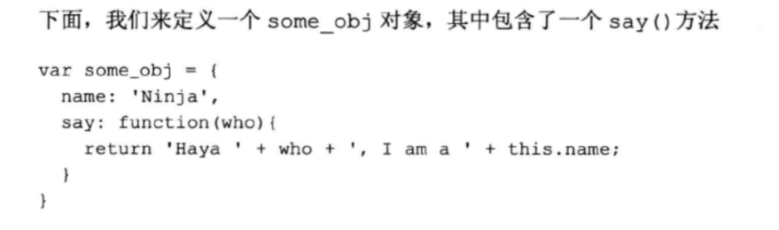
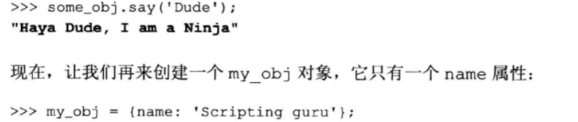
		
		这种情况我们可以调用say()

		>>> some_obj.say.call (my_obj, ‘ Dude’);
		“Heya Dude, I am a Scripting guru”

		如果我们没有将对象传递给call的首参数，或者传递给它的是null,调用对象会被默认为全局对象

		apply() 不同的就是参数的传递形式，这里目标函数所需要的参数都是通过一个数组来传递的

		下面两行代码都是等效的
		
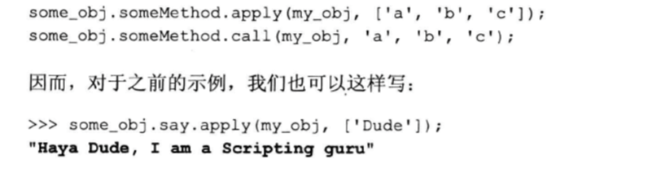

#####4.2.3.3  arguments对象
			1. arguments.callee  则该函数在被调用时就会被返回自身的应用
				🌰 例子
					>>> function f() { return arguments.callee;}
					>>> f()  // f ()

			2. 用arguments.callee  实现匿名函数的递归调用
				🌰 例子
					（
						function (count ){
							if(count <5){
								alert(count) ;
								arguments.callee(++count);
										}
									}
						）(1)

####4.2.4 Boolean 
			>>> var b = new Boolean();  
			注意b是一个对象，不是一个基本的布尔值
			如果要获得这样的基本类型值，用valueOf方法（继承自Object对象）
			>>> var n = new Boolean ();
			>>> typeof b //“object”
			>>> typeof b.valueOf() //“boolean”
			>>> b.valueOf() //false

			>>>Boolean ( { } ) //true

			>>>var b1 = new Boolean(true)
			>>>b1.valueOf() //true

			>>>var b2 = new Boolean(false)
			>>>b2.valueOf() //false

			>>> Boolean (b1) //true
			>>> Boolean (b2) //true

####4.2.6 String
			>>> var s = new String (“ Potato”);

			>>> s.toUpperCase() //“POTATO”
			>>> s.toLowerCase() //“potato”
			>>> s.charAt (0); // “P”
			>>> s.indexOf(‘o’); //1  第一个遇到的
			>>> s.indexOf(“o”, 2) //从index2开始
			>>> s.lastIndexOf(‘o’)
			>>>s.indexOf(‘Po’)  //0 如果找不到-1

			区别 substring 和 slice  对第二个数是负数的处理
				1. substring会视为从0开始计数   //substring (!,0)
				2. slice会将它与字符串的长度相加 //slice(1,s.length-1)

			split  可视为join的反操作，后者将一个数组合并成一个字符串
			>>> s.split(“ “) //[‘couch’, ‘potato’]

			concat用于追加字符串
			>>>s.concat(“es”) //“potatoes”

			所有这些都是新字符串，不会改变原字符串

####4.2.7 Math
			Math.random() 返回的是0-1之间的某个数
			100 * Math.random() 返回 0-100之间的某个数
			
			想获得某个max和min之间的值， 公式 (（max - min ）* Math.random()  ) + min

			Math.floor
			Math.ceil
			Math.round

####4.2.8 Date
			var udate = new Date(2012,10,1);



	🌰 2012年5月20日是星期几
		>>> var d = new Date(2012,5,20);
		>>> d.getDay(); //
		❗️因为0是是从星期日开始计数的，所以3是星期三

####4.2.9. RegExp 

#####创建RegExp对象:
			1. var re  = new RegExp  (“j.*t”);
			2. var re = /j.*t/;

#####4.2.9.1 RegExp对象的属性
			1. global   ///g 找出所有匹配的位置
			2. ignoreCase   /// i
			3.multiline    /// m
			4. lastIndex
			5. source

			>>> var re = new RegExp(“j.*t”,”gim”);
			>>> var re = /“j.*t”/gim;

#####4.2.9.2 RegExp对象的方法
			两种查找匹配内容的方法 
			test() 返回boolean
			exec() 匹配字符串组成的数组
			参数都是一个字符串

			>>>/j.*t/.test(“Javascript”)  //false
			>>>/j.*t/i.test(“Javascript”)  //true

			>>>/j.*t/i.exec(“Javascript”) [0] //“Javascript”

#####4.2.9.3 正则表达式  作为string的参数

			方法：
				1. match() 返回匹配内容的数组
				2. search() 返回第一个匹配内容所在的位置
				3. replace()  将匹配文本替换成指定的字符串
				4. split() 根据正则表达式将目标字符串分割成若干个数组元素

				>>> var s = new String (“HelloJavascriptWorld”);
				>>> s.match(/a/); [“a”]
				>>> s.match(/a/g); [“a” , “a”]

				🌰 用户数email地址，用JavaScript将email的前半部分提炼出来，作为后面用户名的建议
				>>> var email = “xysy0506@163.com”
				>>> var username = email.replace(/(.*)@(.*)/,”$1”) ;
				>>> username ; // xysy0506 

				$1 代表第一个括号里的

#####4.2.9.6 回调式替换
				var glob;
				var callback = function(){
						    glob = arguments;
						    return arguments[1];
           						   }

				var re = /(.*)@(.*)\.(.*)/;

				var email = "xysy0506@163.com";

				email.replace(re,callback);  //xysy0506

				>>>glob;
				
				["xysy0506@163.com", "xysy0506", "163", "com", 0, "xysy0506@163.com"]

			
				首参数是正则表达式匹配的内容
				尾参数是被搜索的字符串
				尾参数之前的参数是匹配内容所在的位置
				剩下的参数是regex模式分组的所有匹配字符串组

####4.2.10 Error对象
	
			try{
				iDontExist();
				}catch (e){
					//do nothing 发生异常才执行
					}finally{
						// do nothing 无论发不发生异常都执行
						}

			Error对象的两个基础属性
				e.name
				e.message

🌰
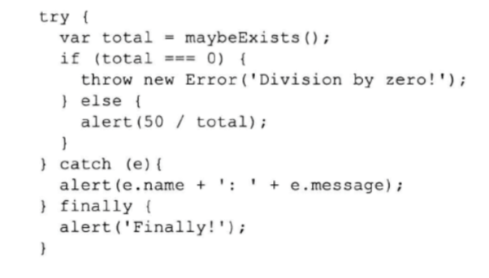
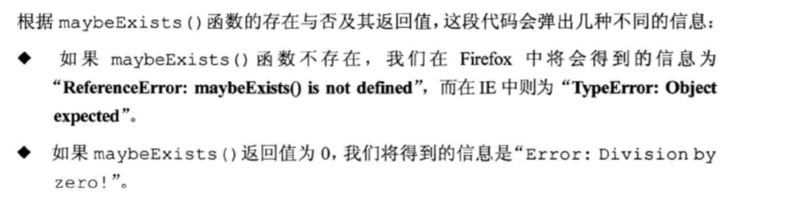		
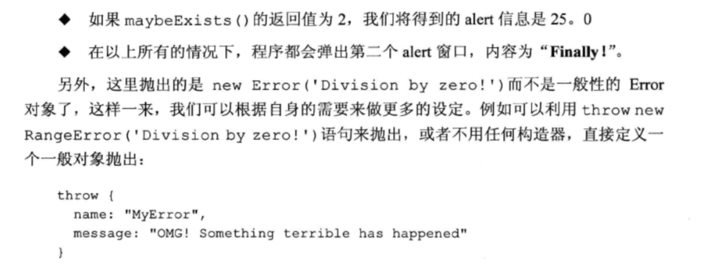


####易误解
try{
	
	try{
		throw new Error("oops");
	}
	finally{
		console.log{"finally"};
	}
}
catch(e){
	console.error("oops",e.message);
}

#####框中的这层因为没有catch所以会跳到外层的catch来处理，但需要先执行finally
执行后：finally
		outer
		oops

####难题：

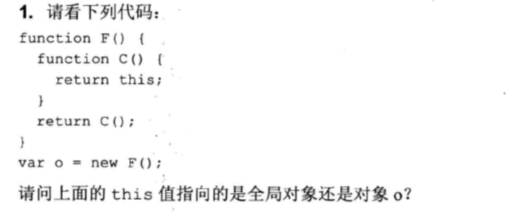

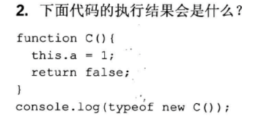

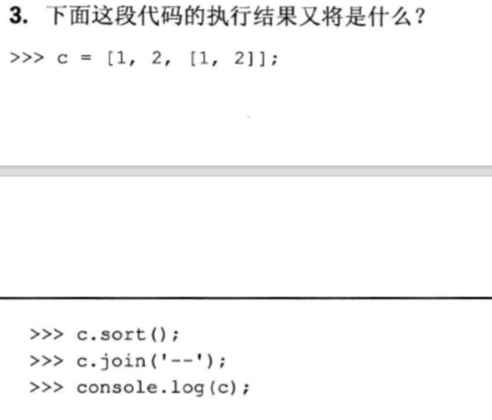



#####答案：
	1.Here, this === window because C() was called without new. Also, o === window because new F() returns the object returned by C(), which is this, and this is window. 

	2. object  因为constructor create的都是object 不是boolean

	3.> var c = [1, 2, [1, 2]]; > c.sort(); > c; [1, Array[1,2], 2]

	This is because sort() compares strings. [1, 2].toString() is "1,2", so it comes after "1" and before "2". The same thing with join():
	> c.join('--'); > c; "1--1,2--2"

###第五章 原型 prototype
####5.1 原型属性
在函数被创建的时候，属性中就包括了prototype属性，初始值为一个空的对象。

	>>>typeof foo.prototype //"object"
	
赋予这个空对象的一些属性和方法，并不会对foo函数本身造成什么影响，但不能对用作构造器

#####步骤
	1. 建个function
	function Gadget(name,color){
	this.name = name;
	this.color = color;
	}
	
	2. prototype添加东西
	Gadget.prototype = {
		prcie:100,
		rating: 3
	};
	
	3.使用原型的方法和属性
	>>>var newtoy = new Gadget('webcam','black');
	>>>newtoy.name;//"webcame"
	>>>newtoy.price // "100"
	
######最重要的是live概念，因为在JavaScript中，对象都是通过引用的方式传递的，所以我们随时可以修改原型，并且与之相关的对象也会继承这个改变

	也就是说，根据上面的例子，我们再给Gadget增加一个方法
	Gadget.prototype.get= function (what){
		return this[what];	
			};
	>>>newtoy.get("price");//100
	
	即newtoy在get方法前已经创立，还是可以使用新添加的get，就是因为是对象live的

####5.1.4 
如果遇上对象的自身属性与原型属性同名的话：对象自身属性的优先级高于原型属性

#####hasOwnProperty()

	>>>newtoy.hasOwnProperty('name');//true
	>>>newtoy.hasOwnproperty('price');//fasle
	
####5.15 isPrototypeOf()
当前对象是否是另一个对象的原型

	例子：
	1. 定义一个简单对象monkey
	var monkey = {
	hair : true;
	};
	
	2. 创建一个Human()的构造器函数，并将其原型属性设置为指向monkey
	function Human(name){
		this.name = name;
	}
	Human.prototype = monkey;
	
	3. 新建一个George的Human对象
	>>> var george = new Human('George');
	>>> monkey.isPrototypeOf(george)//true

####5.16 仅在Firefox存在的\_proto\_
并不等于prototype，是某个实体的对象的属性
而prototype的属性是属于构造函数的属性
_proto_只能在学习或者调试的环境下使用

###5.2 扩展内建对象
内建对象的构造函数（例如Array,String,Object和Function）都是可以通过其原型进行扩展的

####5.2.2 一些原型陷阱
处理原型问题时，注意以下两种行为：

- 将原型对象执行完全替换的时候，可能会触发原型链中的某种异常（exception）
- prototype.constructor属性是不可靠的

即我们将prototype替换，但\_proto\_这个属性，能使对象仍然使用原来的prototype里的东西

######当我们重写某个对象的prototype时，重置相应的constructor属性是一个好习惯

###5.4 练习题

1.Create an object called shape that has a type property and a getType() method:
	

	var shape = {
	type : "",
	getType  = function (){
	return this.type
	};

##第六章 继承

###6.1原型链
通过原型来实现继承关系链
####6.1.1原型链例子
	function Shape(){
		this.name = 'shape';
		this.toString = function(){return this.name;}
	}

	function TwoDShape(){
		this.name = '2D shape';
	}
	
	fucntion Triangle(side,height){
		this.name = 'Triangele';
		this.side = side;
		this.height = height;
		this.getArea = function(){return this.side * this.height / 2;}
	}
	
	TwoDShape.prototype = new Shape();
	Triangle.prototype = new TwoDShape();
	
	//我们将对象的prototype属性重写时，需要重置对constructor属性
	TwoDShape.prototype.constructor = TwoDShape;
	Triangle.prototype.constructor = Triangle;
	
	
####6.1.2 将共享属性迁移到原型中去
######强调！必须在扩展原型对象之前完成继承关系的构建
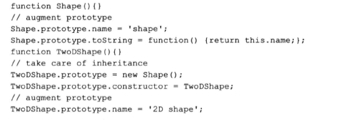
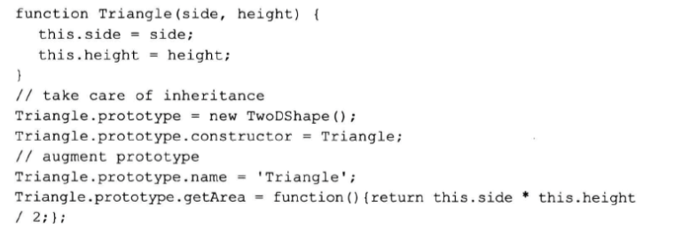

###6.2 new F()
不懂，待补

###6.3 uber ——子对象访问父对象的方式

不懂，待补

#第六章需要重新阅读

##第七章 浏览器环境
###7.2 BOM与DOM
页面的JavaScript代码有一系列可以访问的对象，可以分为两组：

- 当前载入页面所拥有的对象（文档） DOM
- 页面外事物所拥有的对象（浏览器窗口和桌面屏幕）BOM

###7.3 BOM
可以通过全局对象window和window.screen来访问这些BOM对象

####7.3.1 window对象
环境中所以的全局变量都是window的属性，JavaScript核心函数也都是window对象的方法，window对象还有一个作用，提供各种关于浏览器环境的私有数据，例如window对象中各种frame、iframe等等

####7.3.2 window.navigator
navigator是一个用于反映浏览器本身及其功能信息的对象。
navigator。userAgent是一个用于浏览器识别的长字符串，但我们不要依赖这种用户带你字符串，因为很难追踪到所有版本，而且用户可以对该字符串进行修改，伪装成其他浏览器
  
用特性监听法比较好，也就是直接检验浏览器是否有该功能

####7.3.3 firebug的备忘功能
在控制台输入navigator，就可以得到一份完整的属性列表，以及这些属性的当前值

####7.3.4 window.location
location属性是一个用于存储当前载入页面URL信息的对象。  

- location.href显示的是完整的URL
- location.hostname显示相关的域名

循环列出location对象的完整属性列表

	for(var i in location) {console.log(i + ' = "' + location[i] + '"')} 
	
	href
	hash
	host
	hostname
	pathname
	port
	protocol
	search

location对象还提供三个方法，分别是reload()、assign()和replace()  
location.replace方法与assign基本相同，只不过它不会再浏览器的历史记录表中留下记录

