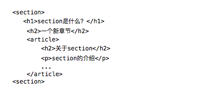
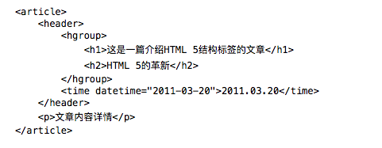
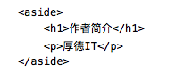
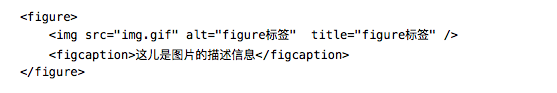
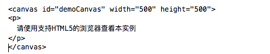
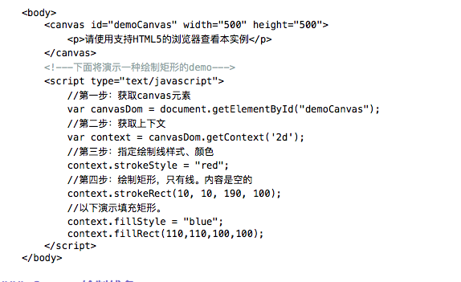

# HTML5

## 认识HTML5

### 1. 什么是HTML5
目前Firefox、Google Chrome、Opera、Safari（版本4以上）、Internet Explorer 9已支援HTML5技术。

### 2.HTML5新特性
#### 2.1 新增拥有具体含义的标签
HTML5新标准中直接添加了拥有具体含义的HTML标签比如：\<article\>、\<footer\>、\<header\>、\<nav\>、\<section\>

#### 2.2 新增更加智能的表单类型
在HTML5的标准中直接添加了智能表单，让这一切都变得那么的简单，比如 calendar、date、time、email、url、search

#### 2.3 让Web程序更加的独立，减少了对第三方插件的依赖。
在HTML5标准中原生的就支持音频、视频、画布等技术。让WEB程序更加独立，更好的适应多种形式的客户端。

#### 2.4 对本地离线存储的更好的支持
HTML5 提供了两种在客户端存储数据的新方法：  

• localStorage - 没有时间限制的数据存储  
• sessionStorage - 针对一个 session 的数据存储

#### 2.5 HTML5即时二维绘图 ,既画布的引入
HTML5 的canvas元素使用 JavaScript 在网页上绘制图像。并拥有多种绘制路径、矩形、圆形、字符以及添加图像的方法。

#### 2.6 JS支持多线程
在不影响UI update及浏览器与用户交互的情况下, 前端做大规模运算，只能通过 setTimeout 之类的去模拟多线程 。而新的标准中，JS新增的HTML5 Web Worker对象原生的就支持多线程。

#### 2.7 WebSockets让跨域请求、长连接、数据推送变得简单
WebSockets是在一个(TCP)接口进行双向通信的技术，PUSH技术类型。WebSocket是html5规范新引入的功能，用于解决浏览器与后台服务器双向通讯的问题，使用WebSocket技术，后台可以随时向前端推送消息，以保证前后台状态统一，在传统的无状态HTTP协议中，这是“无法做到”的。

#### 2.8 更好的异常处理
HTML5(text/html)浏览器将在错误语法的处理上更加灵活。HTML5在设计时保证旧的浏览器能够安全地忽略掉新的HTML5代码。与HTML4.01相比，HTML5给出了解析的完整规则，让不同的浏览器即使在发生语法错误时也能返回完全相同的结果。

#### 2.9 文件API让文件上传和操纵文件变得那么简单
由于项目中经常遇到用Web应用中控制操作本地文件，而之前都是使用一些富客户端技术比如flash，ActiveX，Silverlight等技术。在HTML5的新的提供的 HTML5 File API 让JS可以轻松上阵了。

## HTML5的新的结构元素介绍
### 一、HTML5与HTML4的区别

- 一、HTML5与HTML4的区别
	- 取消了一些过时的HTML4的标签
		- 其中包括纯粹显示效果的标记，如\<font\>和\<center\>，它们已经被 CSS完全取代.
		- 其他取消的属性:acronym, applet, basefont, big, center, dir, font, frame, frameset, isindex, noframes, strike,tt

	- 添加了一些新的元素
		- 更加智能的表单元素：date, email, url等; 更加合理的标签：\<section\>, \<video\>, \<progress\>, \<nav\>, \<meter\>, \<time\>, \<aside\>, \<canvas\>等
	- 文件类型声明
		- 仅有一种类型，\<!DOCTYPE html\>

- 二、HTML5的新结构标签

![][image-1]

- \<section>
	- 定义文档中的节。它用来表现普通的文档内容或应用区块，但section元素标签并非一个普通的容器元素，它表示一段专题性的内容，一般会带有标题。

- ** \<article>** 
	-  特殊的section标签，它比section具有更明确的语义，它代表一个独立的、完整的相关内容块。当我们描述一件具体的事物的时候，通常鼓励使用article来代替section。
	- article会有标题部分（通常包含在header内），也可以包含footer
	- article可以嵌套，内层的article对外层的article标签有隶属关系。

- **\<aside\>**
	- **aside标签用来装载非正文的内容，被视为页面里面一个单独的部分。**它包含的内容与页面的主要内容是分开的，可以被删除，而不会影响到网页的内容、章节或是页面所要传达的信息。**例如广告，成组的链接，侧边栏等等。**

- **\<header\>**
	- header标签定义文档的页眉，通常是一些引导和导航信息。它不局限于写在网页头部，也可以写在网页内容里面。
	- 通常header标签至少包含一个标题标记（h1-h6），还可以包括hgroup标签，还可以包括表格内容、标识、搜索表单、nav导航等

- **\<footer\>**
	- footer标签定义section或document的页脚，包含了与页面、文章或是部分内容有关的信息，比如说文章的作者或者日期。 它和header标签使用基本一样，可以在一个页面中多次使用，如果在一个区段的后面加入footer，那么它就相当于该区段的页脚了

- **\<hgroup\>**
	- hgroup标签是对网页或区段section的标题元素（h1-h6）进行组合。例如，在一区段中你有连续的h系列的标签元素，则可以用hgroup将他们括起来

- **\<figure\>**
	- 用于对元素进行组合。多用于图片与图片描述组合。

## 增强型表单标签

### 增型表单标签
HTML5中，新标准把文本框提示信息、表单校验、日期选择控件、颜色选择控件、范围控件、进度条、标签跨表单等功能直接加入新的表单标签中。 但在众多现代浏览器中，最新版本的Opera浏览器对新型表单的支持才最为完美。

#### Number类型input标签

	<input type="number" name="demoNumber" min="1" max="100" step="1"/>

name: 标识表单提交时的key值 min: 标识当前输入框输入的最小值 max: 标识当前输入框输入的最大值 step: 标识点击增大/减小的时候，增加/减小的步长

#### Email类型input标签

	<input type="email" name="email" placeholder="请输入注册邮箱"/>

当表单在提交前，此文本框会自动校验是否符合邮箱的正则表达式。

#### URL类型的input标签

	<input type="url" placeholder="请输入网址" name="url"/>

#### Tel类型的input标签

	<input type="tel" placeholder="输入电话" name="phone"/>

#### range类型的input标签

	<input type="range" min="0" max="50" step="5" name="rangedemo" value="0"/>

此类型标签的加入，输入范围内的数据变得非常简单容易，而且非常标准，用户输入可感知体验非常好。另外此标签可以跟表单新增加的output标签一块使用，达到一个联动的效果。

	<form oninput="output.value=parseInt(range.value)"/>
	    <input type="range" min="0" max="100" step="5" name="range" value="0"/>
	    <output name="output">0<output/>
	</form>

就是一个滚动条可以拉动

#### 新的日期、时间、月份、星期input标签
Web项目开发，一定会遇到相关的js日期控件，在HTML5中新加入的表单属性将会使Web开发变得更加简洁。

	<input type="date" name="datedemo"/>

相关的日期属性还包括：month、time、week、datetime-local、datetime

#### 颜色选择input标签

	<input type="color" name="colordemo"/>

#### input标签自动完成功能
有的项目会要求实现自动完成或者输入提示功能，在HTML5的支持下将变得简单。

	<input type="text" autocomplete="on" name="demoAutoComplete" list="autoNames" />
	<datalist id="autoNames">
	       <option  value="实验楼" ></option>
	       <option  value="HTML5" ></option>
	       <option  value="input标签" ></option>
	</datalist>

### HTML5表单新属性

- input表单新增加的特有属性
	- autofocus属性，demo:`<input type="text" autofocus="autofocus"/>`此属性可以设置当前页面中input标签加载完毕后获得焦点。
	- max、min、step：这些上面介绍过，都是跟数字相关。
	- placeholder：提示信息属性。
	- multiple：用于文件上传控件，设置此属性后，允许多个文件。
	- 校验属性：设置了required属性后预示着当前文本框在提交前必须有数据输入，而这一切都是由浏览器自动完成。还添加了pattern正则表达式校验

	`<input type="text" autofocus="autofocus" required pattern="\d+"/>`

- 另外一个较大的改进就是增加了form属性，也就是说，任何一个标签都可以指定它所属于一个表单，而不是必须在中进行包裹了。

	`<input type="text" form="demoform" name="demo"/>`

- form表单新增加的属性
	- novalidate属性规定在提交表单时不应该验证 form或input域

	`<form action="" method="POST" novalidate="true"></form>`

- autocomplete属性规定form或input域应该拥有自动完成功能

## HTML5文件操作API

### 几个重要的JS对象  

- FileList对象
	- 它是File对象的一个集合，在HTML4标准中文件上传控件只接受一个文件，而在新标准中，只需要设置multiple，就支持多文件上传，所以从此标签中获取的files属性就是FileList对象实例。 
	- demo：`<input type="file" multiple="multiple" name="fileDemo" id="fileDemo" />`

	下面是关于FileList对象的API的原型：
	 
	interface FileList {
		  getter File? item(unsigned long index);
		  readonly attribute unsigned long length;
	};

- Blob对象
	- 就是一个原始数据对象，它提供了slice方法可以读取原始数据中的某块数据。另外有两个属性：size（数据的大小），type

	看下面的是W3C的API原型:
	 
	interface Blob {
		readonly attribute unsigned long long size;
		readonly attribute DOMString type;
		//slice Blob into byte-ranged chunks     
		Blob slice(
		    optional long long start,
		    optional long long end,
		    optional DOMString contentType
		); 
	};

- File对象
	- 继承自Blob对象，指向一个具体的文件，它还有两个属性：name（文件名）,lastModifiedDate（最后修改时间）

- FileReader对象
	- 设计用来读取文件里面的数据，提供三个常用的读取文件数据的方法，另外读取文件数据使用了异步的方式，非常高效

这个对象是非常重要第一个对象，它提供了四个读取文件数据的方法，这些方法都是异步的方式读取数据，读取成功后就直接将结果放到属性result中。所以一般就是直接读取数据，然后监听此对象的onload事件，然后在事件里面读取result属性，再做后续处理。当然abort就是停止读取的方法。
FileReader对象的三个读取文件数据方法

• readAsBinaryString(Blob blob) 传入一个Blob对象，然后读取数据的结果作为二进制字符串的形式放到FileReader的result属性中。
• readAsText(Blob blob, optional DOMString encoding) 第一个参数传入Blog对象，然后第二个参数传入编码格式，异步将数据读取成功后放到result属性中，读取的内容是普通的文本字符串的形式。
• readAsDataURL(Blob blob) 传入一个Blob对象，读取内容可以做为URL属性，也就是说可以将一个图片的结果指向给一个img的src属性。

### 读取文件上传控件里的文件并将内容已不同的方式展现到浏览器

实例一：获取上传文件的文件名（注：需要引入jQuery）

	<!DOCTYPE html PUBLIC "-//W3C//DTD XHTML 1.0 Transitional//EN" "http://www.w3.org/TR/xhtml1/DTD/xhtml1-transitional.dtd">
	<html xmlns="http://www.w3.org/1999/xhtml">
	<head>
	    <title></title>
	    
	    
	</head>
	<body>
	    <form action="/home/index" method="POST" novalidate="true">
	        <input type="file" multiple="multiple" name="fileDemo" id="fileDemo" /> 
	        <input type="button" value="获取文件的名字" id="btnGetFile"/>
	        

	    </form>
	    

	</body>
	</html>

实例二：读取上传文件内容，然后将文件内容直接读取到浏览器上（注：需要引入jQuery

	<!DOCTYPE html PUBLIC "-//W3C//DTD XHTML 1.0 Transitional//EN" "http://www.w3.org/TR/xhtml1/DTD/xhtml1-transitional.dtd">
	<html xmlns="http://www.w3.org/1999/xhtml">
	<head>
	    <title></title>
	    
	    
	</head>
	<body>
	    <input type="file" name="fileDemo" id="fileDemo" multep/>
	    <input type="button" value="readAsDataURL" id="readAsDataURL" onclick="showDataByURL();"/>
	    <input type="button" value="readAsBinaryString"  id="readAsBinaryString" onclick="showDataByBinaryString();"/>
	    <input type="button" value="readAsText"  id="readAsText" onclick="showDataByText();"/>
	    

	    

	</body>
	</html>

## Canvas绘图API
Canvas就是一个画布，可以进行画任何的线、图形、填充等一系列的操作，而且操作的画图就是js，所以让js编程到了嗑药的地步。另外Canvas不仅仅提供简单的二维矢量绘图，也提供了三维的绘图，以及图片处理等一系列的api支持。

### Canvas的Context对象

- 要使用Canvas来绘制图形必须在页面中添加Canvas的标签

- 只有上面的标签，只能是创建好了一个画布，其中width和height属性就是设置画布的大小。Id属性也是必须的，后面要用Id来拿到当前的Canvas的Dom对象。通过此Canvase的Dom对象就可以获取他的上下文（Context）了，Canvas绘制图形都是靠着Canvas对象的上下文对象

	

- Context上下文默认两种绘制方式： 第一种：绘制线（stroke） 第二种：填充（fill）

### Canvas绘制立体透明矩形

- Canvas绘制步骤：
	- 创建HTML页面，设置画布标签
	- 编写js，获取画布dom对象
	- 通过canvas标签的Dom对象获取上下文
	- 设置绘制样式、颜色
	- 绘制矩形，或者填充矩形

### Canvas绘制线条

Context对象的
- beginPath方法表示开始绘制路径，
- moveTo(x, y)方法设置线段的起点，
- lineTo(x, y)方法设置线段的终点，
- stroke方法用来给透明的线段着色。
- moveto和lineto方法可以多次使用。最后，还可以
- 使用closePath方法，自动绘制一条当前点到起点的直线，形成一个封闭图形，省却使用一次lineto方法。

	<body>
		<canvas id="demoCanvas" width="500" height="600">
		</canvas>
		
	</body>

### Canvas绘制圆形和椭圆

Context上下文的arc方法就是绘制圆形或者椭圆，arc方法的x和y参数是圆心坐标，radius是半径，startAngle和endAngle则是扇形的起始角度和终止角度（以弧度表示），anticlockwise表示做图时应该逆时针画（true）还是顺时针画（false）。

	<canvas id="demoCanvas" width="500" height="600"></canvas>
	

### Canvas绘制图片
Canvas绘制图片应该是他的一大特点或者是亮点吧。当然配合File的API，让JS变得无可匹敌。那接下里给大家演示一下怎样绘制图片，并且做出一个立体效果出来。

	<canvas id="demoCanvas" width="500" height="600"></canvas>
	

没有涉及到Canvas3D绘制的相关内容，而且关于Canvas绘制渐变色、绘制阴影、图片的相关处理操作等

## HTML5本地存储和本地数据库
### 本地存储由来的背景
下面是Cookie的限制：

- 大多数浏览器支持最大为 4096 字节的 Cookie。
- 浏览器还限制站点可以在用户计算机上存储的 Cookie 的数量。大多数浏览器只允许每个站点存储 20 个Cookie；如果试图存储更多 Cookie，则最旧的 Cookie 便会被丢弃。
- 有些浏览器还会对它们将接受的来自所有站点的 Cookie 总数作出绝对限制，通常为 300 个。
- Cookie默认情况都会随着Http请求发送到后台服务器，但并不是所有请求都需要Cookie的，比如：js、css、图片等请求则不需要Cookie。

为了破解Cookie的一系列限制，HTML5通过JS的新的API就能直接存储大量的数据到客户端浏览器，而且支持复杂的本地数据库，让JS更有效率。 HTML5支持两种的WebStorage：

- 永久性的本地存储（localStorage）
- 会话级别的本地存储（sessionStorage）

#### 永久性的本地存储：localStorage
localStorage对象，以便于用户存储永久存储的Web端的数据。而且数据不会随着Http请求发送到后台服务器，而且存储数据的大小机会不用考虑，因为在HTML5的标准中要求浏览器至少要支持到4MB.所以，这完全是颠覆了Cookie的限制，为Web应用在本地存储复杂的用户痕迹数据提供非常方便的技术支持。

localStorage提供了四个方法来辅助我们进行对本地存储做相关操作。

- setItem(key,value)添加本地存储数据。两个参数，非常简单就不说了。
- getItem(key)通过key获取相应的Value。
- removeItem(key)通过key删除本地数据。
- clear()清空数据

	

#### 会话级别的本地存储：sessionStorage
通过此对象可以直接操作存储在浏览器中的会话级别的WebStorage。存储在sessionStorage中的数据首先是Key-Value形式的，另外就是它跟浏览器当前会话相关，当会话结束后，数据会自动清除，跟未设置过期时间的Cookie类似。

sessionStorage提供了四个方法来辅助我们进行对本地存储做相关操作。

- setItem(key,value)添加本地存储数据。两个参数，非常简单就不说了。
- getItem(key)通过key获取相应的Value。
- removeItem(key)通过key删除本地数据。
- clear()清空数据。

	

### 强大的本地数据
虽然HTML5已经提供了功能强大的localStorage和sessionStorage，但是他们两个都只能提供存储简单数据结构的数据，对于复杂的Web应用的数据却无能为力。逆天的是HTML5提供了一个浏览器端的数据库支持，允许我们直接通JS的API在浏览器端创建一个本地的数据库，而且支持标准的SQL的CRUD操作，让离线的Web应用更加方便的存储结构化的数据。

操作本地数据库的最基本的步骤是：

- 第一步：openDatabase方法：创建一个访问数据库的对象。
- 第二步：使用第一步创建的数据库访问对象来执行transaction方法，通过此方法可以设置一个开启事务成功的事件响应方法，在事件响应方法中可以执行SQL.
- 第三步：通过executeSql方法执行查询，当然查询可以是：CRUD。

#### 1. openDatabase方法

	//Demo：获取或者创建一个数据库，如果数据库不存在那么创建之
	var dataBase = openDatabase("student", "1.0", "学生表", 1024 * 1024, function () { });

openDatabase方法打开一个已经存在的数据库，如果数据库不存在，它还可以创建数据库。几个参数意义分别是：

- 数据库名称。
- 数据库的版本号，目前来说传个1.0就可以了，当然可以不填；
- 对数据库的描述。
- 设置分配的数据库的大小（单位是kb）。
- 回调函数(可省略)。

初次调用时创建数据库，以后就是建立连接了。
![][image-2]

	<head>
	 
	    
	</head>
	    <body>
	        <table>
	            <tr>
	                <td>用户名：</td>
	                <td><input type="text" name="txtName" id="txtName" required/></td>
	            </tr>
	               <tr>
	                <td>标题：</td>
	                <td><input type="text" name="txtTitle" id="txtTitle" required/></td>
	            </tr>
	            <tr>
	                <td>留言：</td>
	                <td><input type="text" name="txtWords" id="txtWords" required/></td>
	            </tr>
	        </table>
	        <input type="button" value="保存" id="btnSave"/>
	        

	        <input type="button" value="展示所哟数据" onclick="showAllTheData();"/>
	        <table id="tblData">
	        </table>
	    </body>
	</html>

[image-1]:	1.png
[image-2]:	2.png