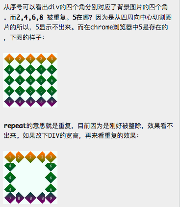
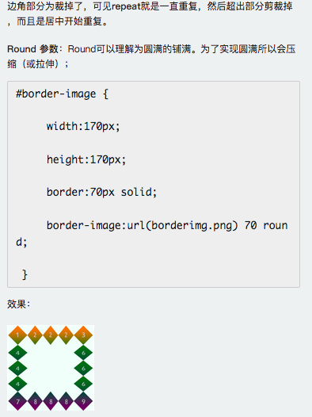
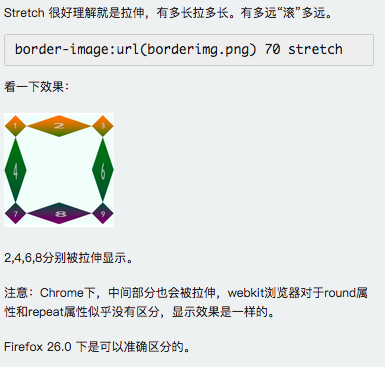

# 十天精通CSS3

目前主流浏览器chrome、safari、firefox、opera、甚至360都已经支持了CSS3大部分功能了，IE10以后也开始全面支持CSS3了。

在编写CSS3样式时，不同的浏览器可能需要不同的前缀。它表示该CSS属性或规则尚未成为W3C标准的一部分，是浏览器的私有属性，虽然目前较新版本的浏览器都是不需要前缀的，但为了更好的向前兼容前缀还是少不了的。

![][image-1]

## 第二章 边框
### CSS3边框 圆角效果 border-radius

	border-radius:10px; /* 所有角都使用半径为10px的圆角 */ 
	border-radius: 5px 4px 3px 2px; /* 四个半径值分别是左上角、右上角、右下角和左下角，顺时针 */ 

**实心上半圆**  
方法：把高度(height)设为宽度（width）的一半，并且只设置左上角和右上角的半径与元素的高度一致（大于也是可以的）。

	div{
	        height: 50px;/*是width的一半*/
	        width:100px;
	        background:#9da
	        border-radius:50px; /*半径至少设置为height的值*/
	}

**实心圆**  
方法：把高度(height)设为宽度（width）的一半，并且只设置左上角和右上角的半径与元素的高度一致（大于也是可以的）。  

	div{
	        height:  100px; /*与width设置一致*/
	        width:100px;
	        background: #9da;
	        border-radius: 50px; /*四个圆角值都设置为宽度或高度值的一半*/
	}

### CSS3边框 阴影 box-shadow（一）
box-shadow是向盒子添加阴影。支持添加一个或者多个。

	box-shadow: X轴偏移量 Y轴偏移量 [阴影模糊半径] [阴影扩展半径] [阴影颜色] [投影方式];

![][image-2] 

X 轴偏移量:  左右偏移 （负数向左）
Y 轴偏移量:  上下偏移 （负数向上 ）

**添加多个阴影**

	.box_shadow{
	    box-shadow:4px 2px 6px #f00（右下）, -4px -2px 6px #000（左上）, 0px 0px 12px 5px #33CC00 inset （内部）;
	}

### CSS3边框 阴影 box-shadow（二）
1、**阴影模糊半径**与**阴影扩展半径**的区别  

**阴影模糊半径**：此参数可选，其值只能是为正值，如果其值为0时，表示阴影不具有模糊效果，其值越大阴影的边缘就越模糊；  
**阴影扩展半径**：此参数可选，其值可以是正负值，如果值为正，则整个阴影都延展扩大，反之值为负值时，则缩小；

2、X轴偏移量和Y轴偏移量值可以设置为负数

### CSS3边框 为边框应用图片 border-image
顾名思义就是为边框应用背景图片，它和我们常用的background属性比较相似。例如：

	background:url(xx.jpg) 10px 20px no-repeat;

想象一下：一个矩形，有四个边框。如果应用了边框图片，图片该怎么分布呢？ 图片会自动被切割分成四等分。用于四个边框。

可以理解为它是一个切片工具，会自动把用做边框的图片切割。怎么切割呢？为了方便理解，做了一张特殊的图片，由9个矩形（70\*70像素）拼成的一张图（210\*210像素），并标注好序号，是不是像传说中的九宫图，如下

![][image-3]

根据border-image的语法：

[image-1]:	1.png
[image-2]:	2.png
[image-3]:	3.jpeg